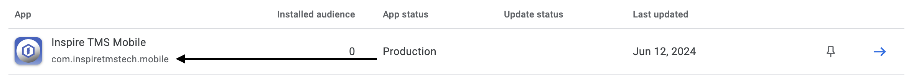

# [CLI Utility] Google Play App Version Code

Retrieve the latest (or next) [versionCode](https://developer.android.com/studio/publish/versioning#versioningsettings) for a Google Play App. Useful for automating build scripts.

## GitHub Action

Using the CLI is incredibly simple, using the pre-compiled [GitHub Action](https://github.com/marketplace/actions/setup-google-app-version-cli-tool):

```yaml

jobs:
  job:
    # ...
    steps:
      - name: Setup Google App Version CLI Tool
        uses: inspire-labs-tms-tech/google-play-app-version-code-cli@latest
        with:
          version: latest
```

## Setup

### Service Account

The CLI uses a Google Service Account `JSON` file to authenticate. 

Setup your service account according to the Expo documentation: https://github.com/expo/fyi/blob/main/creating-google-service-account.md

Ensure to download a `JSON` version of the key-file.

### Install the CLI

#### Latest Version

```shell
# Download the Latest Release
curl -LO https://github.com/inspire-labs-tms-tech/google-play-app-version-code-cli/releases/latest/download/google-app-version.deb

# Install the Latest Release
sudo apt-get install ./google-app-version.deb

# (Optional) Add the Latest Release to Path (to simply call `google-app-version` from any working directory)
sudo ln -s /usr/local/bin/google-app-version/bin/google-app-version /usr/bin
```

#### Specific Version

```shell
# Download a Specific Release
# Replace `v20240613.234416` in the URL with the desired/pinned version
curl -LO https://github.com/inspire-labs-tms-tech/google-play-app-version-code-cli/releases/download/v20240613.234416/google-app-version.deb

# Install the Release
sudo apt-get install ./google-app-version.deb

# (Optional) Add the Release to Path (to simply call `google-app-version` from any working directory)
sudo ln -s /usr/local/bin/google-app-version/bin/google-app-version /usr/bin
```

## Usage

- The CLI supports two output modes:

  1. the `latest`/current `versionCode` of an application
  2. the `next` `versionCode` of an application (just `latest` + 1)

- The contents of the service account's `key.json` file should be passed as an environment variable (useful for CI/CD environments)

### Example

For an application with a production build versionCode of 14:

#### Latest

```shell
JSON=$(cat ~/key.json) && google-app-version latest -f "$JSON" -p com.company.app
# 14
```

#### Next

```shell
JSON=$(cat ~/path/to/key.json) && google-app-version next -f "$JSON" -p com.company.app
# 15
```

### Parameters

- Version (Position 0): `google-app-version <VERSION>`
  - `latest`: the latest, currently released `versionCode` of an application
    - `google-app-version latest ...`
  - `next`: the next-available `versionCode` of an application
    - `google-app-version next ...`

### Required Arguments

- JSON File Contents (`-f` / `--file`): the **contents** (not filepath) of a JSON file for the google service account's credentials
  - Note: if the file's contents are stored locally, instead of in an environment variable, you can use the following command structure to load the JSON file's contents into an environment variable:
    - `MY_JSON_FILE_CONTENTS=$(cat ~/path/to/key.json) && google-app-version -f "$MY_JSON_FILE_CONTENTS" ...`
- Package Name (`-p` / `--package`): the **package** (not application) name
  - this is set the after your first release
  - in the below example image, (Google Play Console > Home > Apps) the package name is `com.inspiretmstech.mobile`



### Optional Arguments

- Verbose Output (`-v` / `--verbose`): print debug-level information to the console
- Help (`-h` / `--help`): print full documentation and exit
- Version (`-V` / `--version`): print the CLI version and exit
